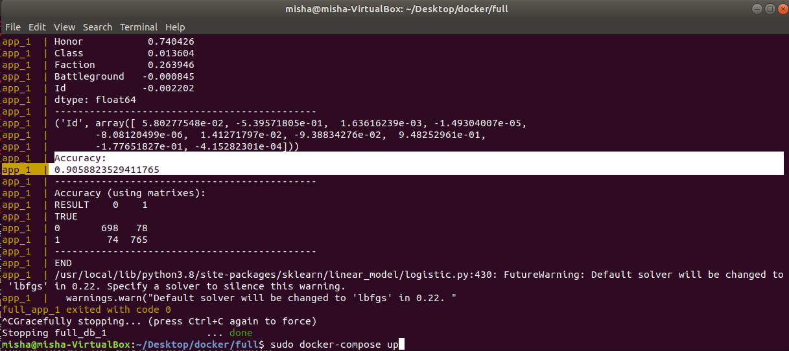

# Docker-PSU

## Task

1.  Create a postgres image with fullfield database
2.  Create a python image with a machine learning library
3.  Create a python image with a machine learning library which uses as a dataset a table / database tables from the first image and gives the result of machine learning on screen
4.  Create a **_compose_** file that includes a description of 2 services based on the created images
5.  Run the script from the second image to demonstrate the results

## Solution

`git clone https://github.com/mishhan/docker-psu.git`

`cd docker-psu`

### Database image

Data - https://www.kaggle.com/cblesa/world-of-warcraft-battlegrounds

`cd db`

`[sudo] docker build -t test-postgre .`

[Dockerfile](./db/Dockerfile)

`COPY ./init /docker-entrypoint-initdb.d`

[See here](https://hub.docker.com/_/postgres) - Initialization scripts

The same as: `psql -U postgres -d data_db -f db.sql`

### App image

`cd .. --step back in docker-psu`

`cd app`

`[sudo] docker build -t test-python .`

[Dockerfile](./app/Dockerfile)

### Compose up

`[sudo] docker-compose up`

### Result

